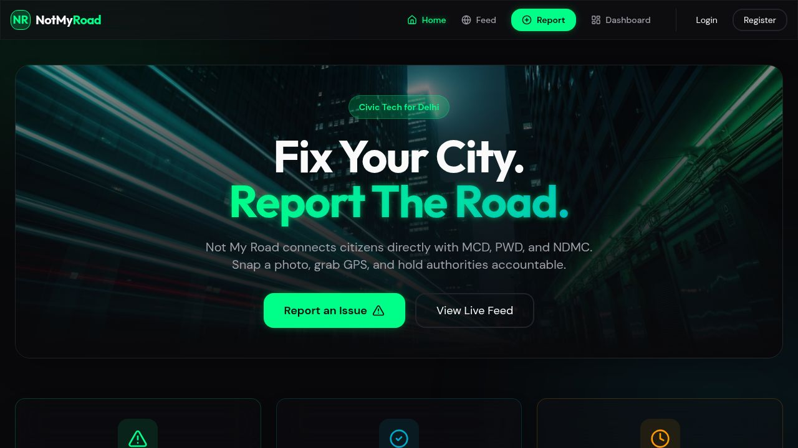
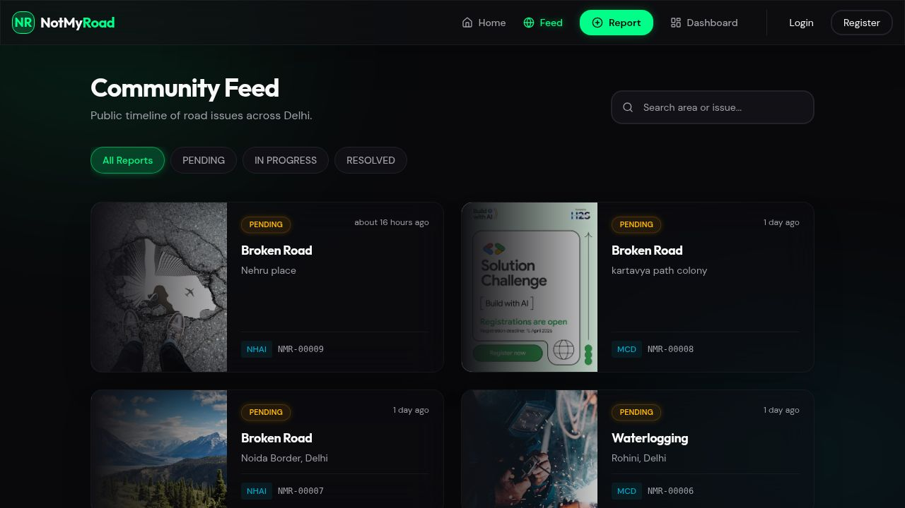
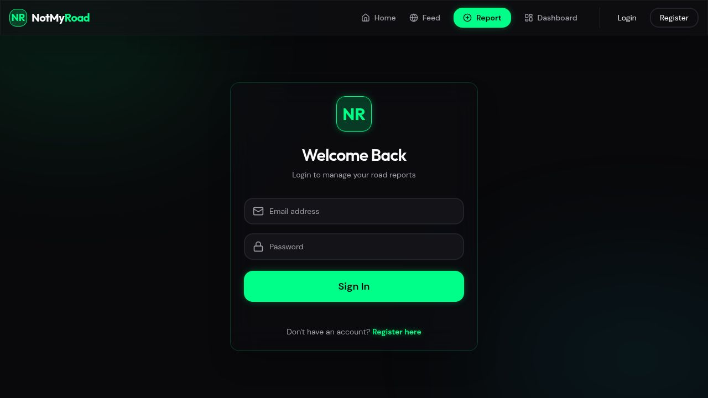

# NotMyRoad — Delhi Road Issue Tracker

> **Fix Your City. Report The Road.**
> A civic-tech web platform for reporting road issues in Delhi — built for citizens, designed to hold authorities accountable.

[](.)
[](LICENSE)
[](.)

---

## 🚀 Live Deployment

- **Frontend (Web):** [https://notmyroad.vercel.app](https://notmyroad.vercel.app)
- **Backend (API):** [https://notmyroad-delhi.onrender.com](https://notmyroad-delhi.onrender.com)

## ⚡ Built with Vibecoding

This project was forged through modern *vibecoding*—an AI-collaborative engineering flow leveraging **Replit** and **Antigravity**. By seamlessly combining rapid AI-generated scaffolding with heavy manual refinement, reverse proxy debugging, and precise technical architecture by me, this app went from idea to full-stack production at breakneck speed.

---

## What is NotMyRoad?

NotMyRoad is an open, citizen-facing web platform that lets anyone in Delhi photograph a road issue, log it against the responsible authority (MCD, PWD, NHAI, DDA), track its resolution publicly, and generate a tweet draft to amplify pressure. Every report is visible to the community — creating a living accountability map of Delhi's roads.

> **⚠️ Important Notice on Automation:**
> Currently, compiling authority complaints and posting tweets are handled **manually** by citizens using the drafts and data generated by our platform. In the future scope, these actions will shift to **fully automatic** workflows (programmatic API tweets and automated government portal submissions).

---

## Screenshots

### Web App (Active)

| Home | Community Feed | Profile / Dashboard |
|------|---------------|---------------|
|  |  |  |

### Mobile App (Under Development)

> The React Native / Expo mobile application is currently **Under Development** and will be released in an upcoming phase.

---

## Tech Stack

### Monorepo Structure

```
notmyroad/
├── artifacts/
│   ├── not-my-road/        # React + Vite web app  (served at /)
│   ├── nmr-mobile/         # React Native + Expo   [UNDER DEVELOPMENT]
│   └── api-server/         # Node.js + Express 5   (API backend)
├── lib/
│   ├── api-spec/           # OpenAPI 3.1 spec + Orval codegen config
│   ├── api-client-react/   # Auto-generated React Query hooks + typed fetch client
│   ├── api-zod/            # Auto-generated Zod schemas from OpenAPI spec
│   └── db/                 # Drizzle ORM schema + PostgreSQL connection
└── scripts/                # Utility scripts
```

### Frontend — Web (`artifacts/not-my-road`)

| Concern | Choice |
|---------|--------|
| Framework | React 19 + Vite 7 |
| Routing | wouter |
| Data fetching | TanStack Query v5 (auto-generated hooks via Orval) |
| Styling | Tailwind CSS v4 + minimal shadcn/ui |
| Animations | Framer Motion |
| Icons | Lucide React |
| Theme | Dark urban (`#080808` bg, `#00FF7F` neon green accent) |

### Backend (`artifacts/api-server`)

| Concern | Choice |
|---------|--------|
| Runtime | Node.js 24 |
| Framework | Express 5 |
| Database ORM | Drizzle ORM |
| Database | PostgreSQL |
| Auth | Authentication using JWTs and secure local storage |
| Validation | Zod (schemas auto-generated from OpenAPI spec) |

---

## Current Feature Set

| Feature | Web Status |
|---------|------------|
| Browse community feed | ✅ Active |
| Filter by status | ✅ Active |
| Live platform stats | ✅ Active |
| Email/password auth & Profile | ✅ Active |
| Submit report (wizard format) | ✅ Active |
| View own reports (dashboard) | ✅ Active |
| Report detail + timeline | ✅ Active |
| Tweet draft generation | ✅ Manual copy/paste |
| File Authority Complaint | ⚠️ Manual right now |

---

## Known Gaps & Future Roadmap for Automation

This section documents exactly where the product currently falls short and what the roadmap looks like to shift our manual actions to fully automatic workflows.

### 1. Generating Tweets — Transitioning to Automatic
**Current state:** The platform generates a pre-formatted tweet draft per report (authority tag, location, hash tags). **Users must manually copy-paste this into X/Twitter.**
**Future Scope:** 
- Programmatic account posting via the Twitter v2 API.
- We will deploy an `@NotMyRoadDel` bot account that quote-tweets and automatically escalates heavily upvoted reports directly without manual intervention.

### 2. Official Government Portal Auto-Filing — Transitioning to Automatic
**Current state:** Reports live only within NotMyRoad's database. Authorities are only notified if a user manually submits a complaint to the MCD/PWD portals utilizing NotMyRoad's text generation.
**Future Scope:**
- Over the next year, formal API MoUs and webhook integrations will be established. 
- LLM-powered browser automation (like Playwright) will systematically auto-fill and submit grievances to NDMC, MCD, and PWD web forms immediately upon a user's local submission on our app.

### 3. AI Image Recognition for Issues
**Future Scope:** Integrating Google Gemini Vision API to instantly evaluate user-uploaded road images, automatically labeling whether it constitutes "moderate waterlogging" or a "severe pothole". This bypasses the user manual-entry workflow entirely.

---

## Getting Started (Local Development)

### Prerequisites

- Node.js 20+
- pnpm package manager
- PostgreSQL Database URL

### Setup

```bash
# Clone and install
git clone https://github.com/your-org/notmyroad.git
cd notmyroad
pnpm install

# Setup API Server Config
cd artifacts/api-server
cp .env.example .env
# Important: Update DATABASE_URL with complete uri encoding

# Start Web Server and API locally
pnpm run dev --filter @workspace/api-server
pnpm run dev --filter @workspace/not-my-road
```

## Contributing
PRs welcome! Especially in regards to automating the API connection pipelines mapped out in the Roadmap. 

---

## License
MIT — see [LICENSE](LICENSE).
