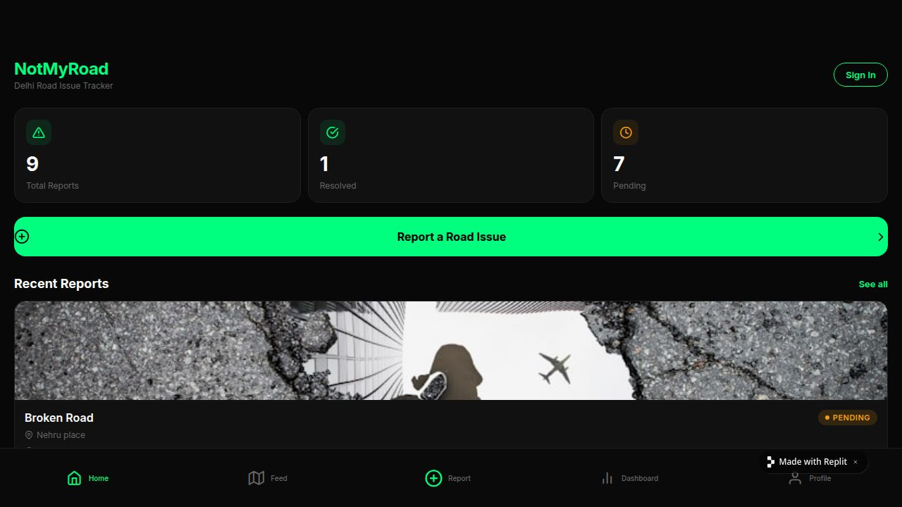
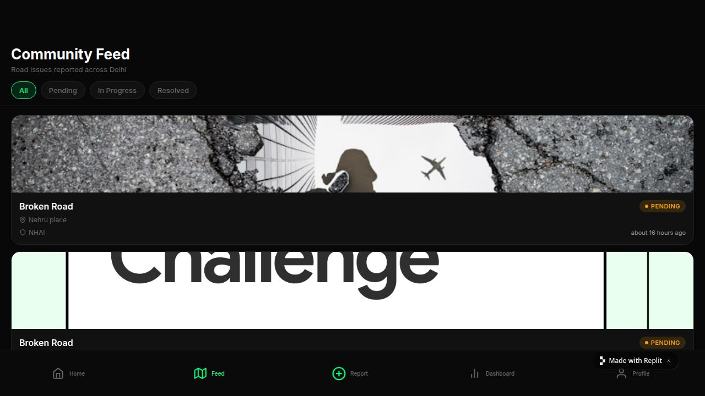
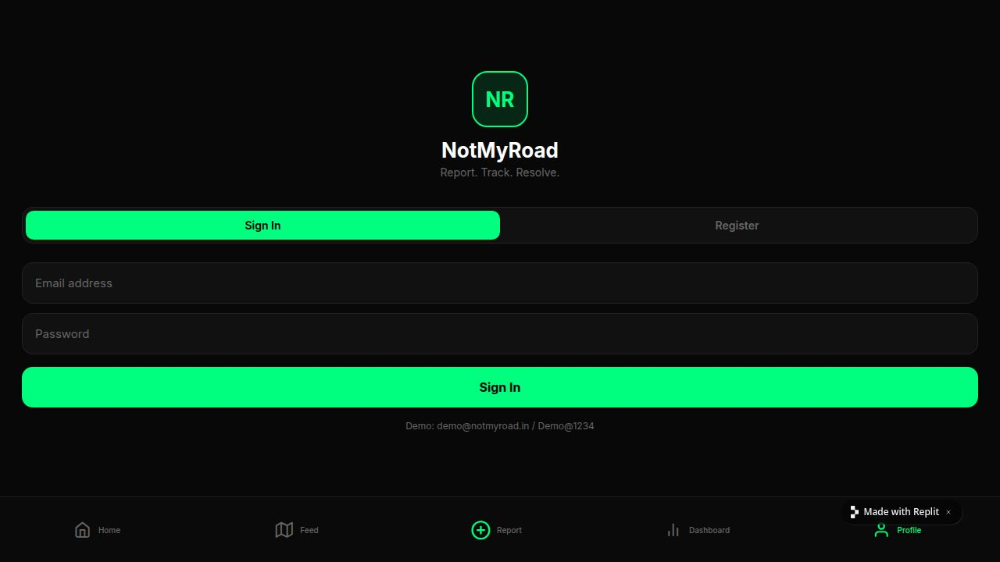

# NotMyRoad

> **Fix Your City. Report The Road.**
> A civic-tech platform for reporting road issues in Delhi — built for citizens, designed to hold authorities accountable.

[](.)
[](LICENSE)
[](.)

---

## What is NotMyRoad?

NotMyRoad is an open, citizen-facing platform that lets anyone in Delhi photograph a road issue, log it against the responsible authority (MCD, PWD, NHAI, DDA), track its resolution publicly, and generate a tweet draft to amplify pressure. Every report is visible to the community — creating a living accountability map of Delhi's roads.

The core belief: **sunlight is the best disinfectant**. By making every pothole, broken road, and waterlogging spot publicly visible with timestamps and authority tags, we make inaction politically costly.

---

## Screenshots

### Web App

| Home | Community Feed |
|------|---------------|
|  |  |

| Sign In / Auth |
|----------------|
|  |

### Mobile App (React Native / Expo)

| Home — Live Stats | Community Feed | Profile / Auth |
|-------------------|---------------|----------------|
|  |  |  |

---

## Tech Stack

### Monorepo Structure

```
notmyroad/
├── artifacts/
│   ├── not-my-road/        # React + Vite web app  (served at /)
│   ├── nmr-mobile/         # React Native + Expo   (mobile app)
│   └── api-server/         # Node.js + Express 5   (API backend)
├── lib/
│   ├── api-spec/           # OpenAPI 3.1 spec + Orval codegen config
│   ├── api-client-react/   # Auto-generated React Query hooks + typed fetch client
│   ├── api-zod/            # Auto-generated Zod schemas from OpenAPI spec
│   └── db/                 # Drizzle ORM schema + PostgreSQL connection
└── scripts/                # Utility scripts
```

Managed with **pnpm workspaces**. A single OpenAPI spec drives type-safe code generation across all packages — change the spec, run codegen, and both web and mobile immediately get updated hooks, types, and validators.

### Frontend — Web (`artifacts/not-my-road`)

| Concern | Choice |
|---------|--------|
| Framework | React 19 + Vite 7 |
| Routing | React Router v7 |
| Data fetching | TanStack Query v5 (auto-generated hooks via Orval) |
| Styling | Tailwind CSS v4 |
| Animations | Framer Motion |
| Icons | Feather Icons |
| Theme | Dark urban (`#080808` bg, `#00FF7F` neon green accent) |

### Frontend — Mobile (`artifacts/nmr-mobile`)

| Concern | Choice |
|---------|--------|
| Framework | React Native 0.81 + Expo SDK 54 |
| Routing | Expo Router v6 (file-based, same pattern as Next.js) |
| Data fetching | Same TanStack Query hooks as web (shared `api-client-react` package) |
| Auth persistence | `@react-native-async-storage/async-storage` (JWT token) |
| Icons | `@expo/vector-icons` (Feather set) + SF Symbols on iOS |
| Tab bar | Native tabs (Liquid Glass on iOS 26+), Expo Blur fallback |

### Backend (`artifacts/api-server`)

| Concern | Choice |
|---------|--------|
| Runtime | Node.js 24 |
| Framework | Express 5 |
| Database ORM | Drizzle ORM |
| Database | PostgreSQL (Replit-managed, env: `DATABASE_URL`) |
| Auth | `express-session` (web) + JWT Bearer tokens (mobile) |
| Validation | Zod (schemas auto-generated from OpenAPI spec) |
| Logging | Pino + pino-http |
| Build | esbuild (single ESM bundle) |

### Codegen Pipeline

```
lib/api-spec/openapi.yaml
        │
        ▼  pnpm run codegen  (Orval)
        │
        ├──▶ lib/api-client-react/   (React Query hooks + typed fetch client)
        └──▶ lib/api-zod/            (Zod schemas for runtime validation)
```

Any API change flows through the spec → regenerate → both clients update automatically, with TypeScript catching mismatches at compile time.

---

## Authentication

### Dual Strategy (Web + Mobile)

| Client | Mechanism | Storage | Expiry |
|--------|-----------|---------|--------|
| Web | `express-session` cookie | HttpOnly cookie (server-managed) | 7 days |
| Mobile | JWT Bearer token | `AsyncStorage` | 30 days |

Login and register both return a `token` field in the response. The mobile app stores this in AsyncStorage and passes it on every request via `Authorization: Bearer <token>`. The backend's JWT middleware validates the token and populates the session, so all existing session-protected routes work without modification.

---

## API Reference

All routes prefixed `/api/`.

| Method | Path | Auth | Description |
|--------|------|------|-------------|
| `GET` | `/healthz` | — | Health check |
| `GET` | `/stats` | — | Platform-wide stats (total, resolved, pending) |
| `GET` | `/reports` | — | List reports (`?status=` `?userId=` `?limit=`) |
| `POST` | `/reports` | ✅ | Create report |
| `GET` | `/reports/:id` | — | Single report detail |
| `PATCH` | `/reports/:id` | ✅ | Update status / append timeline event |
| `POST` | `/auth/register` | — | Register → returns `{ user, token, message }` |
| `POST` | `/auth/login` | — | Login → returns `{ user, token, message }` |
| `GET` | `/auth/me` | ✅ | Current user |
| `POST` | `/auth/logout` | ✅ | Destroy session |

---

## Database Schema

```sql
-- Users
users (
  id           SERIAL PRIMARY KEY,
  email        TEXT UNIQUE NOT NULL,
  password_hash TEXT NOT NULL,
  name         TEXT NOT NULL,
  created_at   TIMESTAMP DEFAULT NOW()
)

-- Reports
reports (
  id             SERIAL PRIMARY KEY,
  user_id        INTEGER REFERENCES users(id),
  user_name      TEXT NOT NULL,
  image_url      TEXT,
  latitude       NUMERIC,
  longitude      NUMERIC,
  area           TEXT NOT NULL,
  issue_type     TEXT NOT NULL,   -- pothole | broken_road | waterlogging | missing_manhole | damaged_divider | other
  road_type      TEXT NOT NULL,   -- main_road | highway | lane | colony_road
  description    TEXT,
  authority      TEXT NOT NULL,   -- MCD | PWD | NHAI | DDA
  status         TEXT DEFAULT 'pending',  -- pending | in_progress | resolved
  tweet_draft    TEXT,
  timeline       JSONB,           -- [{status, note, timestamp}]
  days_unresolved INTEGER GENERATED,
  created_at     TIMESTAMP DEFAULT NOW(),
  updated_at     TIMESTAMP DEFAULT NOW()
)
```

---

## Getting Started (Local)

### Prerequisites

- Node.js 24+
- pnpm 10+
- PostgreSQL (or use `DATABASE_URL` from Replit)

### Setup

```bash
# Clone and install
git clone https://github.com/your-org/notmyroad.git
cd notmyroad
pnpm install

# Set environment variables
cp .env.example .env
# Fill in DATABASE_URL and SESSION_SECRET

# Run DB migrations
pnpm --filter @workspace/db run push

# Start everything in parallel
pnpm --filter @workspace/api-server run dev
pnpm --filter @workspace/not-my-road run dev
pnpm --filter @workspace/nmr-mobile run dev
```

### Demo Account

```
Email:    demo@notmyroad.in
Password: Demo@1234
```

### Regenerate API Client (after spec changes)

```bash
pnpm --filter @workspace/api-spec run codegen
```

---

## Current Feature Set

| Feature | Web | Mobile |
|---------|-----|--------|
| Browse community feed | ✅ | ✅ |
| Filter by status | ✅ | ✅ |
| Live platform stats | ✅ | ✅ |
| Email/password auth | ✅ | ✅ |
| Submit report (4-step wizard) | ✅ | ✅ |
| View own reports (dashboard) | ✅ | ✅ |
| Report detail + timeline | ✅ | ✅ |
| Tweet draft generation | ✅ | ✅ |
| Status filter on feed | ✅ | ✅ |

---

## Known Gaps & Planned Integrations

This section documents exactly where the product currently falls short and what the roadmap looks like to close those gaps. These are the honest limitations of the MVP.

---

### 1. Twitter / X API — Tweet Drafts Are Manual

**Current state:** The platform generates a pre-formatted tweet draft per report (authority handle tagged, location, issue type, hashtags). Users must manually copy-paste this into Twitter/X.

**Gap:** No programmatic posting. The Twitter v2 API requires OAuth 1.0a per-user authentication and a **Twitter Developer App** approved for "Write" scope.

**Planned integration:**
- `POST /api/reports/:id/tweet` — OAuth dance to post on user's behalf
- OR a dedicated `@NotMyRoadDel` bot account that quote-tweets reports above a "community upvote" threshold
- Library: `twitter-api-v2` npm package
- Requires: Twitter Developer Portal app approval (typically 1–3 days)

---

### 2. Official Government Portal Auto-Filing — Not Connected

**Current state:** Reports live only within NotMyRoad's database. Authorities are notified by public social pressure only.

**Gap:** No automated filing to official channels:
- [mcd.gov.in complaint portal](https://mcd.gov.in) — web form only, no public API
- [311-equivalent: NDMC App](https://ndmc.gov.in) — mobile-only, no API
- [PWD Delhi grievance portal](https://pwd.delhi.gov.in) — login-wall, no API
- [PG Portal (India)](https://pgportal.gov.in) — REST API exists but requires government-signed MoU

**Planned integration:**
- **Short-term (3–6 months):** Zapier/Make webhook → manual email to authority inboxes with structured report data
- **Medium-term (6–12 months):** GenAI-powered browser automation (Playwright + LLM) to auto-fill government portal forms — triggered when a report crosses a vote threshold
- **Long-term:** Formal API MoU with MCD/PWD under Digital India initiative; alternatively use RTI (Right to Information) filings as a paper trail

---

### 3. AI / GenAI Integration — Not Present

**Current state:** Issue type, authority, and description are all manually selected/entered by the reporter.

**Gaps:**
- No image analysis (pothole severity estimation, issue classification from photo)
- No auto-routing (which authority is actually responsible for *this specific road* based on its administrative classification)
- No description auto-generation from photo + GPS
- No duplicate detection (same pothole reported 12 times)

**Planned integration:**
- **Image classification:** Google Gemini Vision or GPT-4o to classify issue type and estimate severity from the uploaded photo
- **Authority routing:** Cross-reference GPS coordinates with a road ownership database (Delhi's road ownership data is on the [Delhi Open Data portal](https://data.delhi.gov.in)) to auto-assign authority
- **Duplicate detection:** Embedding-based similarity search (pgvector extension on PostgreSQL) to cluster nearby reports of the same issue
- **Description generation:** LLM-generated structured description from photo + GPS + issue type for consistent, formal language suitable for official complaints
- API: `POST /api/reports/analyze` — returns `{ suggestedIssueType, suggestedAuthority, severity, description, duplicateOf? }`

---

### 4. Authentication — No Social / OAuth Login

**Current state:** Email + password only. JWT for mobile, sessions for web.

**Gaps:**
- No Google OAuth ("Sign in with Google")
- No Apple Sign In (required for App Store distribution)
- No phone number / OTP (very common in India)
- Password reset flow not implemented

**Planned integration:**

| Provider | Why it matters | Library |
|----------|---------------|---------|
| Google OAuth 2.0 | Most used login in India | `passport-google-oauth20` |
| Apple Sign In | App Store requirement for apps with social login | `passport-apple` |
| Phone OTP (SMS) | Preferred auth method in Indian tier-2/3 cities | Twilio Verify or MSG91 |

All three can be added as Passport.js strategies on the existing Express backend. The JWT returned stays the same — only the identity verification method changes.

---

### 5. Database — Replit PostgreSQL, Not Production-Grade

**Current state:** Using Replit's managed PostgreSQL. Works fine for development and low-traffic usage.

**Gaps for scale:**
- No **Row Level Security (RLS)** — all data access control is in application code
- No **realtime subscriptions** — feed doesn't push new reports live
- No **edge functions** — all compute is centralized
- No **connection pooling** configured (important at >100 concurrent users)
- No **read replicas** for the public feed

**Planned migration to Supabase:**

| Feature | Benefit |
|---------|---------|
| RLS policies | Database-enforced access control (e.g., users can only update their own reports) |
| Realtime | `supabase-js` subscription on `reports` table → live feed updates without polling |
| Storage | Replace image URL field with Supabase Storage buckets for direct photo uploads |
| Connection pooling | PgBouncer built-in, handles thousands of concurrent connections |
| Auth (optional) | Could replace the custom JWT auth with Supabase Auth (supports Google, Apple, phone OTP out of the box) |

Migration is a schema-compatible drop-in since we're already using Drizzle ORM — just swap the `DATABASE_URL`.

---

### 6. Photo Uploads — URL Input Only

**Current state:** The report wizard accepts a photo URL (pasted by the user). No camera or gallery access.

**Gap:** Real users won't paste URLs. They need to snap a photo directly.

**Planned integration:**
- **Mobile:** `expo-image-picker` (already installed) → capture photo → upload to Supabase Storage → store the returned URL
- **Web:** `<input type="file">` + presigned Supabase Storage URL → direct browser upload
- **API:** `POST /api/reports/upload-url` → returns presigned upload URL (avoids routing large files through the Express server)

---

### 7. Maps / GPS — Text Area Only

**Current state:** Users type the area/location as free text. Coordinates are hardcoded to Delhi center (28.6139°N, 77.209°E) for all reports.

**Gaps:**
- No map picker for precise location
- No GPS auto-detection on mobile
- No map view of all reports (the "accountability map" idea)

**Planned integration:**
- **Mobile GPS:** `expo-location` (already installed) → `Location.getCurrentPositionAsync()` → reverse geocode with `expo-location` or Google Maps Geocoding API
- **Map picker:** `react-native-maps` on mobile, `react-leaflet` on web (OpenStreetMap tiles, free)
- **Feed map view:** Cluster markers by authority on a Delhi map — clicking a cluster shows all reports in that area

---

### 8. Notifications — None

**Current state:** No notifications of any kind. Users have no idea if their report status changed.

**Planned integration:**
- **Push notifications (mobile):** Expo Push Notifications → Firebase Cloud Messaging → notify reporter when status changes to `in_progress` or `resolved`
- **Email notifications:** Resend or SendGrid — "Your report #NMR-0042 has been marked In Progress by MCD"
- **Authority email alerts:** When a report is submitted, send a structured email to the relevant authority's public complaint inbox

---

### 9. Admin / Authority Dashboard — Not Built

**Current state:** No interface for authorities (MCD, PWD, NHAI, DDA officers) to triage and update report statuses.

**Planned:**
- Separate `/admin` route with role-based access (new `role` field on `users` table: `citizen | authority | admin`)
- Authority dashboard: filter reports by their jurisdiction, bulk-update status, add timeline notes
- Stats dashboard: average resolution time, most common issue types by area

---

### 10. Upvoting / Community Signal — Not Implemented

**Current state:** All reports are equal regardless of how many people have seen the same pothole.

**Planned:**
- `report_votes` table: `(report_id, user_id)` — one vote per user per report
- Sort feed by vote count
- Threshold-based actions: reports with 10+ votes trigger automated authority email; 50+ votes trigger tweet from @NotMyRoadDel bot

---

## Roadmap

```
Phase 1 (Now — MVP)
✅ Web app + Mobile app
✅ Email auth (session + JWT)
✅ Report wizard
✅ Community feed
✅ Dashboard
✅ Tweet draft generation
✅ Status timeline

Phase 2 (Next 3 months)
□ Real photo uploads (Supabase Storage)
□ GPS location picker (expo-location + maps)
□ Google / Apple / Phone OTP auth
□ Push notifications (Expo + FCM)
□ Migrate to Supabase (RLS + realtime feed)
□ Upvote system

Phase 3 (3–6 months)
□ GenAI image classification + authority auto-routing
□ Duplicate detection (pgvector)
□ Twitter/X API integration (community bot)
□ Authority portal integration (email → form auto-fill)
□ Admin dashboard for authority officers
□ Public accountability map (react-leaflet / mapbox)

Phase 4 (6–12 months)
□ Formal govt API integrations (PG Portal MoU)
□ RTI filing automation
□ Multi-city expansion (Mumbai, Bangalore, Hyderabad)
□ Native iOS / Android apps (App Store + Play Store)
□ NGO / RWA partnership portal
```

---

## Contributing

```bash
# Fork → clone → branch
git checkout -b feature/your-feature

# Install
pnpm install

# Make changes, then regenerate API client if you changed the spec
pnpm --filter @workspace/api-spec run codegen

# Typecheck
pnpm run typecheck

# Submit PR
```

PRs welcome, especially for any of the "Planned" items in the gaps section above.

---

## License

MIT — see [LICENSE](LICENSE).

---

*Built with frustration, caffeine, and genuine anger at Delhi's roads.*
